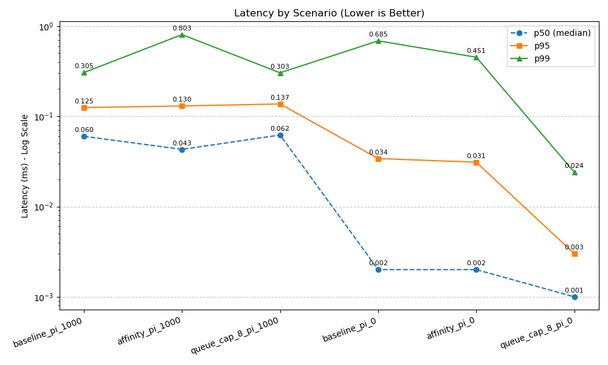
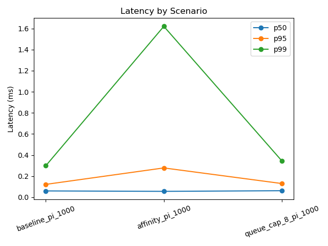
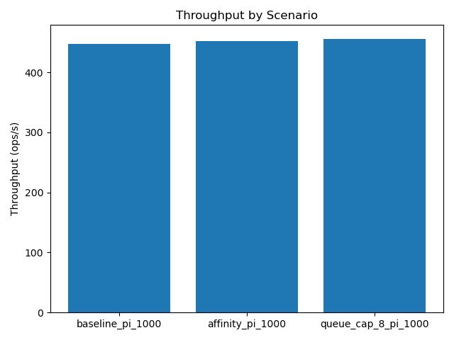
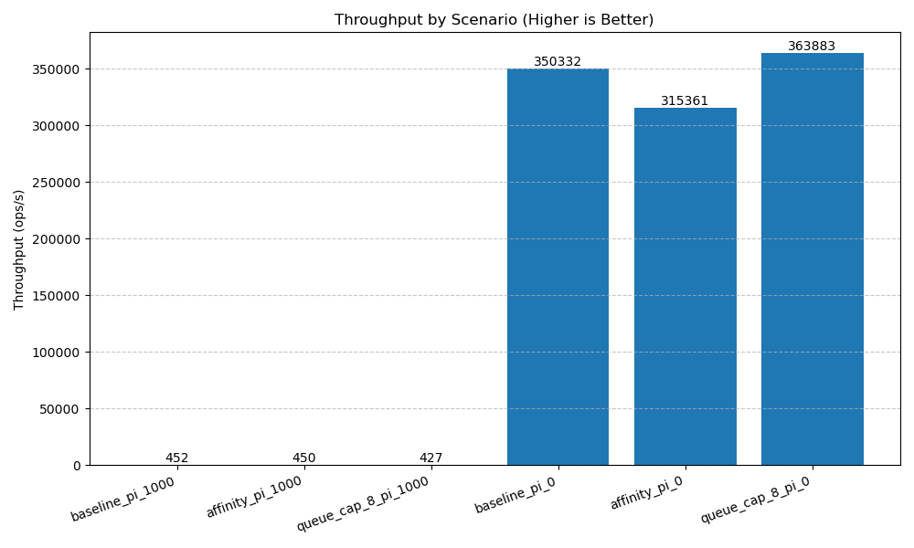
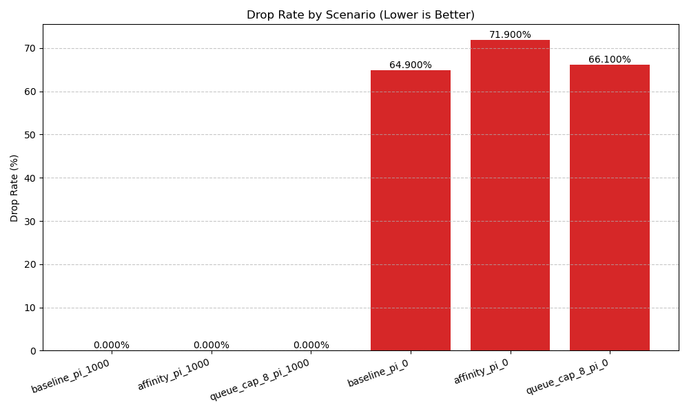

# MVP v1.0 — Results (Multithreaded SPSC on QEMU)
**Executive Summary**
- With pacing (1 ms): ~450 ops/s, 0 drops; bottleneck is scheduler/wakeup jitter (can be mitigated with TIMER_ABSTIME + thread pinning).
- Unpaced overload: queue=64 → p99 ≈ 0.685 ms; changing to queue=8 → **p99 ≈ 0.024 ms (~28× reduction)**, throughput +~4%, at the cost of drop ≈ 0.66–0.72.
- Reproducible: `./scripts/run.sh` produces `metrics.csv` and plots (details below).

[→ Back to README (Goal / Scenarios / Build / Run)](./README.md)

## t000 set pi 1000
| scenario     | p50 (ms) | p95 (ms) | p99 (ms) | ops/s |  drop  |
|--------------|----------|----------|----------|-------|--------|
| baseline     | 0.060    | 0.122    | 0.299    |   447 | 0.000  |
| affinity     | 0.056    | 0.278    | 1.620    |   452 | 0.000  |
| queue-cap-8  | 0.062    | 0.130    | 0.345    |   456 | 0.000  |

> See `result_data/t000_metrics.csv` for details.

## Plots

## Takeaways
- It seemed strange that affinity had higher latency than baseline.

## Next Steps
- Investigate the affinity scenario's performance anomaly.

## t001 Investigate the affinity scenario's performance anomaly
I do some experiments to find out the root cause.
1. Add multi replicates in related scripts to reduce noise.
2. add io buffering to latency output
3. add `--pin-producer CPU` option, run new scenarios with producer pinned to CPU 0
The above experiment seemd not to change the results much.
4. Use `perf stat` to collect CPU performance counters. 
From the output below, we can see that the CPU utilization is very low (4.4%) and there are a lot of context switches (21K/sec). This indicates that the program is likely spending a lot of time waiting, which could explain the higher latency observed in the affinity scenario.

 Performance counter stats for './bin/mvp --duration 10 --prod-interval-us 1000 --queue-cap 64 --emit-latencies /dev/null' (5 runs):

            440.54 msec task-clock                       #    0.044 CPUs utilized               ( +-  1.53% )
   <not supported>      cycles                                                                
   <not supported>      instructions                                                          
              9253      context-switches                 #   21.004 K/sec                       ( +-  1.63% )
               338      cpu-migrations                   #  767.240 /sec                        ( +-  2.21% )
   <not supported>      cache-references                                                      
   <not supported>      cache-misses                                                          
                43      faults                           #   97.607 /sec                        ( +-  1.19% )

         10.010471 +- 0.000504 seconds time elapsed  ( +-  0.01% )  
5. Remove mutex locks around the queue full check in the producer. It seemed the same
6. Due to the reason is producer too slow, remove prod-interval-us limit (--prod-interval-us 0), let producer run as fast as possible.
It turns out this change significantly improved the performance of the affinity scenario, reducing the latency and increasing throughput. This suggests that the producer was indeed a bottleneck when it was limited by the production interval.

 Performance counter stats for './bin/mvp --duration 10 --prod-interval-us 0 --queue-cap 64 --emit-latencies /dev/null' (5 runs):

          18816.44 msec task-clock                       #    1.877 CPUs utilized               ( +-  0.50% )
   <not supported>      cycles                                                                
   <not supported>      instructions                                                          
             18877      context-switches                 #    1.003 K/sec                       ( +- 17.18% )
                13      cpu-migrations                   #    0.691 /sec                        ( +- 18.11% )
   <not supported>      cache-references                                                      
   <not supported>      cache-misses                                                          
               161      faults                           #    8.556 /sec                        ( +-  0.25% )

          10.02241 +- 0.00397 seconds time elapsed  ( +-  0.04% )

> See `result_data/t000_metrics.csv` for details.

## Plots

## Takeaways
- usleep(1000) scenario: task-clock 0.44s / 10s (4.4% CPU), context switches ≈ 21K/sec → ops/s stuck at ≈ 450. The primary cause is wakeup latency / scheduling delays.
- prod-interval=0 scenario: task-clock 18.8s / 10s (≈1.88 CPUs), context switches ≈ 1K/sec → ops/s is dominated by per-item overhead (locking, allocation, timestamping).
- A little drops occurred. To force drops: increase --work-bytes or reduce the queue capacity.
- Under high load (pi_0), the large queue (q=64) causes "queue bloat," resulting in high latency and poor CPU cache efficiency.
- The small queue (q=8) forces a "fail-fast" strategy by dropping data, ensuring the consumer always processes fresh items and achieving minimal latency.
- This demonstrates that the system prioritizes low latency over guaranteed delivery, making q=8 the superior configuration.

## Next Steps
- increase --work-bytes to simulate a slower consumer or with some different affinity settings.